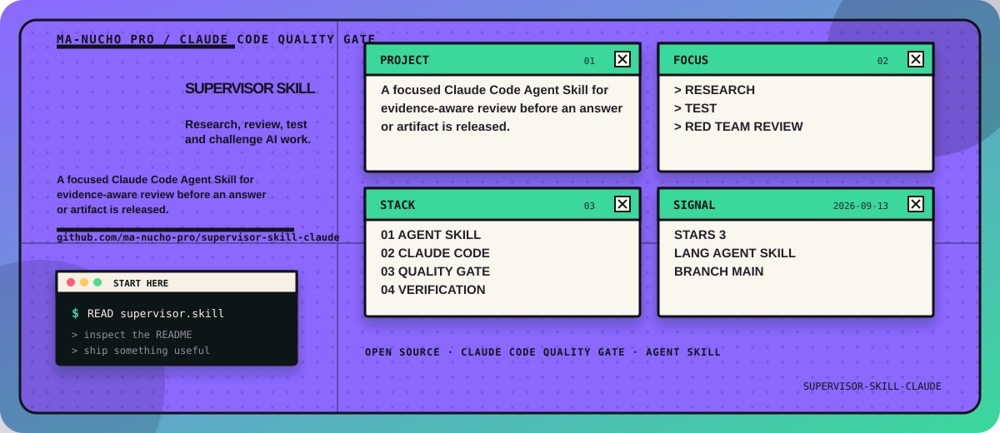

<!-- manucho-readme-banner:start -->

  

<!-- manucho-readme-banner:end -->

  

# SUPERVISOR SKILL

Research, review, test and challenge AI work.

A focused Claude Code Agent Skill for evidence-aware review before an answer or artifact is released.

## Focus

- Research
- Test
- Red Team Review

## Start

supervisor.skill
